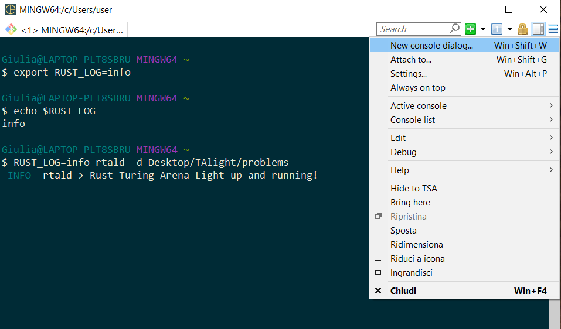
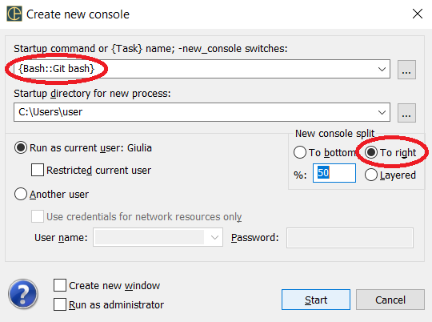
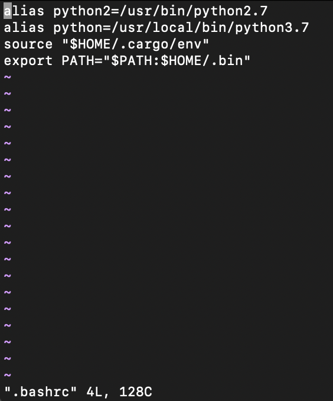

# What is TALight

Are you a teacher/student/researcher/executive passionate about transmitting some problem solving competences, techniques, methods or skills? Do you want to acquire new competences in a lively, concrete and effective way? Do you want to promote them so that they come to new life in your children/students/employers/clients/customers/citizens? Would you like to promote your discoveries or products? Would you like to propose an interesting and instructive challenge, or organize a selection or recruiting campaign reaching to the alive ones?
<details>
<summary>TALight offers you ...</summary>
TALight offers you the perfect tool and open framework for making up your favorite problem into a fully fledged didactic inclusive Montessori toy, allowing to organize and offer smooth interactive didactic paths around it and automatic feedback services to promote autonomous exploration and learning.
Also the social and collaborative dimension is empowered in our approach and vision that has motivated the development of TALight, an ongoing process that we hope will surprise you (also in the future :stuck_out_tongue_winking_eye:) and to which everyone is invited to participate.

<details>
<summary>Do you want to acquire new competences?</summary>
Then we refer to you as a **problem solver**. If you can find out the content for you under TALight, then both an active in-depth learning experience and pure fun are assured.
If no such content is already available, then think about making it while you progress in the subject. In this way you will be given a fun opportunity to learn by doing.  
</details>

<details>
<summary>Do you want to transmit competences or assess them? Do you want to share or spread active knowledge on a subject or a complex tool or product?</summary>
Then you should consider becoming a **problem maker** and forge your content in the form of compelling problems and services. The teachings you will put in there will be sought for and deeply absorbed, and the materials you prepare will be highly reusable.  
</details>

<details>
<summary>Do you want to become a problem maker but know only one programming language?</summary>
Yes, the knowledge or the willingness to learn even just the basics of one single programming language of your choice, combined with the knowledge of your subject and the willingness to communicate and transmit an alive competence are just enough. If you have them you can already set up to make up an effective interactive problem truly hitting on the key issues that you want to dispel and share.
</details>

In good conclusion
<details>
<summary>TALight is a minimal but powerful and flexible open system for the design, the sharing, the experimentation and the use of interactive didactic problems which offer rich ongoing instant feedback services to the problem solver (the student, or trainee, or employee, or fellow research colleague).
</summary>
Right now, most problems already available in TALight are of an algorithmic nature. This is mainly because of our own background and because algorithms often represent the ultimate form of archetypal knowledge. However, right now we do not set/state limits on what can be done, and welcome any kind of sensibility and new muses. 
This repository offers the TALight core plus some example problems working under it.
These problems prompt and stimulate the problem solver but are mainly meant to illustrate how making new interesting problems under TALight is in your and in their reach. Yes, we insist on this "also in their reach" both on the solving and on the making side of the coin, which is an important extra-point in our vision.
TALight is meant to be simple to work with and highly democratic.
Among its commitments, in our vision come:

1. no one left behind: the feedback provided to the students should be rich and stimulating.
2. brake on through to the other side: when solving problems and interacting with the system, problem solvers should grow autonomous and get the desire and competence to become problem makers on their own. In fact, this will be the true mark on how much they have learned and grown.
3. to be a problem maker the knowledge of one single programming language of your choice (and just the basics of it) should be enough. Our ambitions are high, we know that competences, experience, and knowledge can go much beyond the mere tools.
4. possible to design didactic projects articulated on problems meant as Montessori games.
5. possible for teachers to share and collaborate on these didactic projects.
6. no installation strictly required for the problem solvers.
</details>
</details>

___
Have a look at our `tutorial collection` (see [next section](#explore-the-example-problems-in-our-tutorial-collection)) to get a feeling about the kind of didactic problems you can cook up yourself with TALight, or what are the features and advantages of the didactic paths and problems you might (in the future) find in TALight collections hosted in the cloud to be publicly available as services.


## Explore the example problems in our tutorial collection

This section gives general instructions on how the problems sitting in a public collection, and their services, can be actually accessed.

<details><summary>As such, this first stage of our tutorial should be read by</summary>

1. problem solvers still new to TALight but now enrolled in a course based on TALight problems, or interested into a didactic path developed under TALight they can get from the cloud.

2. all those new to TALight, included those who want to act as problem makers or take part in the project as problem makers or as TALight platform developers or ecosystem designers.

TALight intends to promote autonomous exploration. We wish these explorations might lead you to find out, discover, experiment and develop resources within you, in your machine, in the cloud, in your fellows, and in the community. But, to be more concrete rather than sound too visionary or idealistic, we exhibit now the intended use of the few basic commands which allow you to access the services of a problem and all other problem contents made available by the problem maker and the cloud hosting service.  

Knowing how to properly access a problem served from the cloud is at the basis to advance to deal with problems cloned in local on your machine. Playing with the problems in local will give you more freedom and control and enrich your opportunities for a wide and interconnected learning experience. Working on the problems cloned in local allows you to modify and adapt the problems themself to your needs and curiosities. Even if you do not modify the problms and leav them untouchd, still the habit to launch an `rtald` daemon dispatching the problem services for the problms sitting in local on your machine and addressing it rather than an opaque `rtald` daemon serving the cloud will give you full control and understanding on the dialogue that occurs between the solutions of the probelem solver and the service servers written by the problem maker.
All this, besides possibly springing you to become a proficient problem solver, will also make it natural for you to digievolve to the next level up and experiment yourself as a problem maker.

</details>

___
The whole problem collection of this multistage tutorial is hosted in the cloud at the web service server `wss://talight.tk/tutorial` that publicly exposes all services of its problems. To have a natural start with TALight, we suggest you to first explore the problems of this collection as deployed by this server. In this stage of the tutorial we illustrate the basic tools through which you can conduct this sort of exploration.

<details><summary>The two things you need before starting this first exploration as a problem solver and how to get them</summary>

Well, to a certain extent a functioning browser is all what you need.
Seriosly: if you only have a smartphone, or no permission to install anything on the available PC, or even if you only want to give a look but are also certain you are not going to write any code, then reaching some TALight services from the browser migh actually be the best option for you to start with. In practice, throught the browser you will access a client in the cloud that will connect to our web service server `wss://talight.tk/tutorial`.

<details><summary>How to access a repl TALight client in the cloud supporting your preferred programming language</summary>

Choose your preferred programming language from the following list. If it is missing, ask us to add it if you are willing to interact also by writing some code, or choose any item in the list if a direct interaction with no coding is all what you or your students might be interested into. 

1. [python](https://repl.it/@RomeoRizziUniVR/rtalpython#README.txt)
2. [cpp](https://repl.it/@RomeoRizziUniVR/rtalcpp#README.txt)
3. [c](https://repl.it/@RomeoRizziUniVR/rtalc#README.txt)

<strong>What to do once you are on the rtal repl for your preferred programming language?</strong>

Aprire la shell e da linea di comando si richiedano i servizi TALight tramite il comando rtal come da primi esempi sequenti:

./rtal -s wss://talight.tk/tutorial help
./rtal -s wss://talight.tk/tutorial list
./rtal -s wss://talight.tk/tutorial list sum -v
./rtal -s wss://talight.tk/tutorial connect --help
./rtal -s wss://talight.tk/tutorial connect sum -a page=sum_and_difference help
./rtal -s wss://talight.tk/tutorial connect sum free_sum


</details>

In order to ask for the services of a TALight server you need the two things listed here below. If you do not have them you can get them has explained and this is most advisable because you will get a better experience.


<strong>Thing 1:</strong> You need to have a terminal or a terminal emulator (with a shell like bash or zsh). If you are on Linux or Mac you already have it.

<details><summary>What if you are on Windows</summary>

Be warned that neither cmd nor Powershell do for it. Also for the rest of this tutorial, be told that when we say "terminal" we do actually mean **terminal** (or **terminal emulator**) and not just a surrogate of it. It should offer you a shell like `bash` or `zsh`. However, if you have installed git on your machine, and have been wise enough to opt for the installation that also includes a bash terminal than you already have it. Otherwise, you can get it as follows.

  Install git (and be wise enough to opt for the installation that also includes the Git Bash and the support for the symlinks).
  
This is an highly recommendable approach since `git` is good to have and, actually, it is quite likely you will need it anyhow, very soon.

<details><summary>How to install git</summary>

Whatever is your platform (Linux, Mac, Windows, ...) the [Getting-Started-Installing-Git](https://git-scm.com/book/en/v2/Getting-Started-Installing-Git) of the [Git Community](https://git-scm.com/community) will give you the best updated instructions on how to install this game changer on your machine. If your are a Windows user, here are two important pieces of advice to follow in the installation process:

1. follow their suggestion (and default option) to get the Git Bash (as they say: "We’ll learn more about those things a little later, but suffice it to say they’re things you want.").

2. ask to activate the support for the symlinks. Notice: though this is a very good thing to do it is not the default option since the versions of Windows before the Creators Update could not manage symlinks natively (make sure you already have that update before installing git. For this follow [these instructions](https://www.cnet.com/how-to/how-to-tell-if-your-pc-is-running-windows-10-creators-update/)).
<details><summary>non-default installation step: where to activate the symlinks for Git Bash</summary>

Here is a screenshot of the installation dialogue window where to activate the symlinks for Git Bash:


</details>

</details>

</details>

___
<strong>Thing 2:</strong> The second and last thing you need is the TALight command `rtal` executable binary specific to your platform (either Linux, or Mac, or Windows).

You have two options on how to get it:

1. **Option 1 [generally recommended]:** if you already know you will next advance to later stages of this tutorial, then, after installing git on your local machine and cloning this repo (explained in later stages of this tutorial), build your own binaries to get all of the TALight utilities in one shot. How to [get Rust and build the binaries](#obtain-the-binaries) is explained in [the file `rtal/README.md`](rtal) of this repo.


2. **Option 2:** download the already compiled binary made available for your platform and set them in.

<details><summary>How to download the binary and place and test it properly</summary>

Here the phases are: downloading, placing and uncompressing, testing and giving convenient accessibility. 

<details><summary>How to download the binary</summary>

Go to [the binaries download page](https://github.com/romeorizzi/TALight/releases/) and choose the correct `rtal` binary for your platform and download the compressed file. For Mac you have one single option (64 bits) and the binary should work equally well on an Intel or an AMD processor. The same with Windows, but here you have two options (32 bits versus 64 bits) and you can [see here](https://support.microsoft.com/en-us/windows/32-bit-and-64-bit-windows-frequently-asked-questions-c6ca9541-8dce-4d48-0415-94a3faa2e13d) for instructions on how to find out which one of the two is the right one for your machine (nowadays 64 bits almost always). In the case of Linux we assume the 64 bits but you have to choose between the Intel-AMD architecture or the ARM architecture (usually meant for servers).

Place the downloaded file in the folder you prefer. If you have already cloned or downloaded this repo then we suggest you to place it in a folder named `TALight/rtal/target/debug` within the copy of this repo on your local machine (to create subfolders you can use the `mkdir` command).
After having placed the file which is correct for your platform on your local machine, proceed as follows.

<strong>Linux/Mac:</strong>
You downloaded a .xz file (the `.xz` extension stands for files compressed with LZMA/LZMA2 compression algorithm). To uncompress this file issue the following command from a terminal: 
```bash
tar xvf filename.tar.xz
```
If in your case the `tar` command does not recognize the file, be told that tar supports .xz from version 1.22 onwards. Update your version if older (check this with `tar --version`). Otherwise, try with a second download (after downloading with a different name or in a different folder, you can also check with the `diff` command whether the content of the two downloads are the same; if they are, you can then exclude a transmission problem). If you get here, contact us for help.

<strong>Windows:</strong>
You downloaded a .zip file. To uncompress this file use any utility like 7-Zip or WinZip, or issue a command like `unzip` from a terminal: 
```bash
unzip filename.zip
```
If all your attempts to unzip the file fail, try with a second download (after downloading with a different name or in a different folder, you can also check with the `diff` command whether the two downloads of the file are identical; if they are, you can then exclude a transmission problem). If you get here, contact us for help.

</details> 

<details><summary>Testing and giving convenient accessibility (as assumed in the following)</summary>

Open a terminal and place yourself in the directory containing the `rtal` executable binary. At this point, if you enter

```bash
ls -l rtal*
```

then you should see the binary and a summary of data about the file, including its permissions (if on Linux or Mac, in Windows the permissions are not included in the file but rather attached to them). In the following, we assume the binary has execution permission.
The name of the binary will be `rtal` on Unix/Linux/Mac and `rtal.exe` on Windows (note: in the case of Windows the name of the binary when you make it is simply `rtal` like for the Unix based systems, but if you download it like explained here, then it is `rtal.exe` since you have been told that downloading it is not the first option and therefore, if you have taken this path, then you are likely to be either an unexprienced user or an user with no rights on his machine and end up in a "protected user" category).

You can check the binary works by issuing:

```bash
./rtal --help
```

or

```bash
./rtal.exe --help
```

if you are on Windows and want to operate the downloaded binary.

At this point we suggest you to make this binary accessible also from other directories by creating (if not already existing) a `.bin` subfolder of your home folder, place a symbolic link to the binary from `.bin`, and adding this folder into your PATH environment variable editing the `~/.bashrc` file (and in the `~/.zshrc` file if you are on Mac where by default you will be using the `zsh` shell). If you are on Windows and could not install git with the Git Bash or any other shell, then you can update your PATH environment variable from a GUI of Windows. You can easily find instructions on how this goes in internet, the GUI interface depends on the version of Windows but the syntax remains the same from version to version of Windows.
To get the syntax that works you can then try it first from the CMD. Be told that the syntax you are using it is different from that you will be using from a shell like bash. In particular:  

1. the separator of the the various paths listed within the `PATH` variable is `;` rather than `:`

2. you use spaces without escaping them with `\`)

3. to refer to the current value of `PATH` (or any other environment variable) you write `%PATH%` rather than `$PATH`
   So, for example, you could end up writing something like:
```
    SET "PATH=%PATH%;C:\Program Files\TALight"
```

However, we suggest you to create the `TALight` folder (where to place the `rtal` binary) in your home folder (you can find it with `cd %HOME%` or just `cd ~`).

Like the browsers in parsing the URL field, any shell (and hence Linux and Mac) use '/' rather than '\' in order to separate the names of the directories when walking along a path in your filesystem. Therefore, if you are on Windows, you should write `~\TALight` instead of `~/TALight` and interpret writings like `~/yourpath/text` as if we had written `~\yourpath\text` in this tutorial.

DESCRIPTION SHORT:
You have to put your .exe file's path into enviroment variable path. To do this go to:
   "My computer -> properties -> advanced -> environment variables -> Path"
and edit path to adding .exe's directory into path.
```

<details><summary>DESCRIPTION LONG for how to set environment variables on Windows</summary>

Windows 10, 8.1, 8

Open start menu,

```
Type Edit environment variables
Open the option Edit the system environment variables
Click Environment variables... button
There you see two boxes, in System Variables box find path variable
Click Edit
a window pops up, click New
Type the Directory path of your .exe or batch file (Directory means exclude the file name from path)
Click Ok on all open windows and start a new terminal (the previously open one will not be affcted by the change).
```
</details>

In case you get error messages complaining about the fact that `rtal` has non been found then check your path.
In case you get error messages complaining you do not have the proper permissions to execute it then you are likely on Windows and should instruct it (or learn how) to launch the terminal as administrator.
In case you get error messages complaining the fact that the rtal file you just downloaded is not executable then you should tell your system that it should regard it as an executable. If on Linux/Mac this is once again an issue of permissions. In any case, here are the instructions to fix things in this last case.

<details><summary>How do I give executable permissions in Linux or Mac?</summary>

To change the permissions of a file use the `chmod` bash command. Enter the following command to give execution permission (x) to all users (a).

```bash
chmod a+x rtal
```
Use `man chmod` to get the help page for the command, where to find out about other options and possibilitis).

</details>

<details><summary>How do I give executable permissions in Windows?</summary>

To change object access properties you can right-click the object, go into properties, and then security. If you're signed in as an administrator, you'll be able to modify access properties such as the read, write, and execute permissions.
</details>

</details>

</details>

</details>

___
We assume that, in one way or the other, you now have the terminal and an `rtal` executable properly placed and working as explained above.
From here, try out the following actions.

To see the list of problems currently available on our tutorial collection server:

```bash 
rtal -s wss://talight.tk/tutorial list
```

(Of course, you should write `rtal.exe` instead of `rtal` if on Windows.)

To get general help:

```bash 
rtal -s wss://talight.tk/tutorial help
```

To get more specific help on an `rtal` subcommand:

```bash 
rtal -s wss://talight.tk/tutorial help connect
```

To list the services of a deployed problem, like e.g. problem sum:

```bash 
rtal -s wss://talight.tk/tutorial list sum
```

To verbose out the format for the arguments supported by a problem service:

```bash 
rtal -s wss://talight.tk/tutorial list -v sum
```

Avendo quindi compre che il problema `sum` offre un servizio di `help`  quali siano le opzioni disponibili per quel parametro potremmo andare a scoprire informazioni più specifiche riguardo ai servizi del problema con:
```bash
./rtal -s wss://talight.tk/tutorial connect sum -a page=sum_and_difference help
```

To request a service:

```bash 
rtal -s wss://talight.tk/tutorial connect sum free_sum
```

To request a service specifying a non-default value for a parameter:
```bash 
rtal -s wss://talight.tk/tutorial connect -a obj=max_product sum free_sum
```

To turn off the colors in the feedback (in case your situation does not support for it and our automatic detection mechanism for this limit has failed, then strange strings (called escape sequences in jargon) will clutter the feedback):
```bash 
rtal -s wss://talight.tk/tutorial connect -n -aobj=max_product sum free_sum
```

To connect a bot of yours to play on your behalf:

```bash 
rtal -s wss://talight.tk/tutorial connect -e -aobj=max_product sum free_sum -- ~/TALight/example_problems/tutorial/sum/bots/python/sum_mysimplebot.py 
```
<strong>If you are on Windows than you should write:</strong>
```bash 
rtal -s wss://talight.tk/tutorial connect -e -aobj=max_product sum free_sum -- python ~/TALight/example_problems/tutorial/sum/bots/python/sum_mysimplebot.py 
```
<strong>This is because only `.exe` files can be executed on Windows, scripts can not (even if their first line is the correct she-bang).

Of course, you can also use this second and longer form of the command also on Linux and Mac, but then it must be the case that the version of python set as default in your current environment is the correct one to run the bot. 
</strong>


Ok, that bot did not behave that well because it was a simple one, but you can try the `sum_mymaxproductbot.py` in the same directory (of this report that you have cloned in local). Or you can assign to `sum_mysimplebot.py` a simpler task:

```bash 
rtal -s wss://talight.tk/tutorial connect -e sum free_sum -- ~/TALight/example_problems/tutorial/sum/bots/python/sum_mysimplebot.py 
```

When you succeed teaching a competence (like when you succeed instructing a bot to do something) then you get confirmed to have acquired that competence in the deep. Therefore, the submission of a bot offers a means to assess the competence. We might thus offer you an evaluation on your submissions. Apart for checking what is going on, you might then prefer to turn off the full report on the interaction between your bot and the program written by the problem maker who designed the service. In this case, just drop the `-e` flag:

```bash 
rtal -s wss://talight.tk/tutorial connect sum free_sum -- ~/TALight/example_problems/tutorial/sum/bots/python/sum_mysimplebot.py 
```

Since problem `sum` offers an `help` service, you can also get immediate directions about the problem by asking to this service, selecting the specific page through the use of arguments:

```bash 
rtal -s wss://talight.tk/tutorial connect sum help -a sum_and_difference
```

With:

```bash 
rtal -s wss://talight.tk/tutorial get sum
```

you invoke the `get` subcommand of the command `rtal` to download the `.tar` file `sum.tar`. This file is the archive of the public folder of problem `sum` on the `wss://talight.tk` server. Once you untar this folder, you find into it the statement of the problem `sum` and all other material relating to the problem (explanations, videos, links, ...) that the problem maker has collected and decided to make public (i.e., accessible to you through this simple mechanism). The folder `public` may be a rich tree of directories, and the whole tree, together with any material that is symlinked from within the tree (even if the material il placed outside) will then end up in the transmitted archive.

<details><summary>How to untar an archive into the original folder</summary>  

Untar with:

```bash 
tar -xvf sum.tar
```

If the archive is zipped (you can understand this since the extension will be either `.tgz` or `.tar.zip` insetad than `.tar`):


```bash 
tar -xvzf sum.tgz
```

On Windows you can also use any utility like 7-Zip or WinZip.

</details>


## How to more fully access the contents of a problem collection (if made available as a `git` repo)

Well, though less satisfactory, you can still do this without installing `git` on your machine. If you are working on a lab or public library PC on which you have no permission to install software this might be your only option to get the problem material in local.

Actually, there are a few possible scenarios here. 

In any case, we assume the PC has internet connection.

<details><summary>But what if I am not given any writing permission and can not even download material from the web</summary>  

In any case, with an internet connection working and a browser, you will always have the possibility to ask for the services offered from the cloud as explained in the previous section. Moreover, every `git` repo has a web site, like the one from which you are likely to be reading this Markdown `README.md` file. Though not that comfortable (and the dynamic material, if present, might not be rendered) you can simply navigate through that site. Actually, this might even be the most convenient option sometimes for a first look.  

</details>

If you can also download stuff from the internet, then you will always be given the possibility to download a public git repo of the problem collection in local. In the case of GitHub, just click the large green button that you find at the top of the home page of the repo. This already gives you full access to the whole material the problem maker has put in the git repo (which, in principle, should include that placed in the public folder on every possible cloud hosting of the problem).

<details>
Press the green button at the top of this GitHub page (the page of the repo).
Choose to download a compressed file, then uncompress it on your machine and locate it accordingly to your preferences. The only thing that will be missing will be the hidden `.git` directory.
</details> 


However, if `git` is installed on the machine, then cloning the repo is possible. Cloning is always better than dowloading since not only it is more handy but also establishes a connection with the repo and you can more conveniently maintain your local copy updated.

<strong>Attention (for Windows users):</strong> 
This TAL repo makes use of symlinks since they help avoding unnecessary and undesirable duplications of files and help keeping things well organized and readily accessible.
This means that for cloning it propery on Windows, after having opened the git bash as Administrator, you must launch the clone command with the correct parameter. More precisely:
```bash
git clone -c core.symlinks=true https://github.com/romeorizzi/TALight.git
```

Still, if you also intend to contribute to a git repo (act also pushes and not only pulls and clones), then be told that until recent versions of Windows 10, Windows could not manage symlinks in a fully satisfactory way.
However, since a relatively recent version of Windows it is now possible (and we recommend you to do so) to activate the management of the true symlinks by activating the "developer mode" ("modalità sviluppatore"):

[https://docs.microsoft.com/en-us/windows/apps/get-started/enable-your-device-for-development](https://docs.microsoft.com/en-us/windows/apps/get-started/enable-your-device-for-development)

In order to have this possibility your Windows 10 should have been updated to the 2017 release (Creators Update, a free of charge and important update). How to check if you already have upgraded to include the Creators Update and how to do it now in case not is [explained here in clear details](https://www.cnet.com/how-to/how-to-tell-if-your-pc-is-running-windows-10-creators-update/):

[https://www.cnet.com/how-to/how-to-tell-if-your-pc-is-running-windows-10-creators-update/](https://www.cnet.com/how-to/how-to-tell-if-your-pc-is-running-windows-10-creators-update/)

If you did not know about this update you can get hints on new functionalities even just as a consumer user [here](https://www.computerhope.com/jargon/c/creators-update.htm) and [here](https://www.howtogeek.com/278132/whats-new-in-windows-10s-creators-update/). Notice however that we are not pressing you to update your drivers, which might always be a different story (if you are happy with your drivers there might be no reason to do that).

However, the only new feature that we ask you to set up now is telling Windows you need the management, development and collaborative functionalities like e.g. the native support for the symlinks. Follow the instructions here:

[https://docs.microsoft.com/en-us/windows/apps/get-started/enable-your-device-for-development](https://docs.microsoft.com/en-us/windows/apps/get-started/enable-your-device-for-development)


Also, when you install Git Bash you are given your chance to activate the symlinks. If you missed that chance, unistall and reinstall git with the Git Bash as explained in that section.


<details><summary>To the problem maker</summary>

Publishing a problem collection on a repo might empower the learning experience and enrich the learning opportunity. In particular, your possibility to test everything in local will be enanched. Not only you can now test your bots in local before sending them to the services in the cloud, but now you can also watch them more closely when both ends of this interaction sit on your local machine. Now you can also modify them and add prints to debug the communication protocol that the problem has defined for them to act within.
All this added possibility to experiment is a precious opportunity to get under the hood by doing and has the further benefit to facilitate the transition from problem solver to problem maker. Making is the best and ultimate way of learning and can also offer opportunities for real projects that turn the evaluation from an artificial and frustrating to a stimulating and really inclusive experience. In the next section we will see how the problems you have here played with in this first level tutorial can be fully accessed in the backstage. The problem collection of the tutorial is a public git repo. To follow us there you will need to set up `git` on your machine. If you did not already have `git`, then we consider this as a first clear example on how TALight prompts towards self-empowerment since `git` is the portal towards open source projects and communities.

Sharing the repo with collaborators (and consider having your students among them) might allow for better and new opportunities and energies to come to life. You can collaborate with teachers spread elsewhere in your country but commitment to the same topic. This opens the possibility to really join the forces for the joint design and realization of didactic curricular material.  

</details>

## How to get TALight running on your machine

The following preamble might appear as of exclusive interest of the problem maker, but in fact helps putting things in proper perspective also for the problem solver. 

<details><summary><strong>A TALight problem collection can be put in action by</strong></summary>

1. hosting it on a cloud server that exposes the services designed for the problems comprising the collection. The server in the cloud will here serve the requests of the problem solvers by launching the service serving programs written by the problem maker;

2. giving access to its repo so that the problem solvers can clone it on their local machine. The problem solver has now full and direct access to all what the problem maker has decided to ultimately include in the public (or only shared) repo and can also launch its local server to answer its own requests without further need for a working internet connection and without loading on the server at every request. In this way, even a teacher/instructor/field expert/promoter with no server available can put in action its problem collection and active learning material. With no expenses, no limitations, and, under a certain regard, in the best possible way: the problem solver having direct access to the material is both a value and a resource. Not only he might become more autonomous but he might also more easily spot out corrections and also find it natural to brake on through to the other side to enjoy collaboration with the problem maker. TALight might help in vanishing the walls that make school sort of a prison and helps in crating an environment where both the students and the teachers enjoy the experience to be on the same side, working and possibly collaborating towards shared goals. One limitation with this possibility is that most often among the services there are evaluators containing solutions to the problem, which, unless with mature born students, will spoil the problem. Another obvious problem with this modality would then be with 

3. one question every instructor should pose itself is: why not to activate both modalities (like for the problems in this tutorial)? Of course, the answer depends on a lot of factors but do not be scared: as long as you keep sensitive on this from the aspects that matter most, you can even experiment and adjust.  

</details>

___
Setting up the full fledged TALight system might empower your learning experience and enriches the learning opportunity. Making is the best and ultimate way of learning and can also offer opportunities for real projects that turn the evaluation from an artificial and frustrating to a stimulating and really inclusive experience. In the next section we will see how the problems you have here played with in the first level tutorial in the previous section can now be fully accessed in the backstage. The problem collection of the tutorial is a public git repo and we have already seen how to access it directly even without an installation of git on your machine.
 
However, to follow us here in this more advanced section, you first need to set up `git` on your machine. If you did not already have `git`, then we consider this as a first clear example on how TALight prompts towards self-empowerment since `git` is the portal towards open source projects and communities.      

In short, at this stage of this multistage tutorial and at this level of use of TALight you **are required to install `git` on your machine**.

You are reading the `README.md` file of an open source project that aims at fostering a wide collaboration network as well as your skills and competences, included those in basic fundamental technological tools that abilitate you to collaborate in projects. `Git` is the empowering technology to get the best from open source projects.

<details><summary><strong>How to get git and its power</strong></summary>

Whatever is your platform (Linux, Mac, Windows, ...) the [Getting-Started-Installing-Git](https://git-scm.com/book/en/v2/Getting-Started-Installing-Git) of the [Git Community](https://git-scm.com/community) will give you the best updated instructions on how to install this game changer on your machine. If your are a Windows user, here are two important pieces of advice to follow in the installation process:

1. follow their suggestion (and default option) to get the Git Bash (as they say: "We’ll learn more about those things a little later, but suffice it to say they’re things you want.").

2. ask to activate the support for the symlinks. Notice: though this is a very good thing to do it is not the default option since the versions of Windows before the Creators Update could not manage symlinks natively (make sure you already have that update before installing git. For this follow [these instructions](https://www.cnet.com/how-to/how-to-tell-if-your-pc-is-running-windows-10-creators-update/)).
<details><summary>non-default installation step: where to activate the symlinks for Git Bash</summary>

Here is a screenshot of the installation dialogue window where to activate the symlinks for Git Bash:


</details>

Even if you do not make any other more advanced use of git, having it installed will simplify other steps in the installation process to follow and, more importantly, will allow you to better connect to this repo or other reports (possibly of TALight problems). Even if you do not intend to contribute to their ongoing development, this means that it will be easy for you to maintain updated your local version of their contents and get the new exercises and/or features currently under development. To get the updates just launch the command

```t
git pull
```
from any directory of the repo. (In case you have overwritten some files of the repo then a conflict arises. This prevents the downloading of the new content (otherwise your modifications will go lost). If you are stucked in this situation and do not want to delete your modified files before pulling the official version of the repo, then you can simply move your modified files to some other folder or rename them with new names so that the conflict (the risk of loosing work you have done) will be resolved.) 

However, we also advise you to get at least a rough idea of what git has to offer you. Again, the [Documentation page of the Git community](https://git-scm.com/doc) is an ideal place where to get directions.

The main reasons for you to get into `git` are: not only `git` offers you important facilities (free and robust) like backups and working directories that you can in simplicity share among your devices, and powerful and intrinsically safe time machines over them and on your work, but it offers you the means to share and collaborate on your projects and, in fact, it is the portal to the world of open source projects (git was designed by Linus Torvalds in order to scale up its projects concerning the development of the Linux operating system to a wide collaborative dimension).
Not only TALight is open source software, but we foresee and foster that problem makers from different countries/regions (but maybe of a same discipline) might collaborate on more or less open didactic projects.
</details> 

___
Now, the best and simplest option you have is to download this repo through git, so that you will remain connected with this open source projects and have the opportunity to easily update.

<details><summary><strong>Clone this repo (assuming you have `git`)</strong></summary>
Assuming you have `git` installed on your machine:

1. open a shell (that is, a terminal, or cmd, or power shell)
2. go to your home directory, and enter:
```bash
git clone https://github.com/romeorizzi/TALight.git
```
to clone the content of this repo.
Of course, you can achieve the same result by any other means if you prefer.

<strong>Attention (for Windows users): 
This TAL repo makes use of symlinks since they help avoding unnecessary and undesirable duplications of files and help keeping things well organized and readily accessible.
This means that for cloning it propery on Windows, after having opened the git bash as Administrator, you must launch the clone command with the correct parameter. More precisely:
```bash
git clone -c core.symlinks=true https://github.com/romeorizzi/TALight.git
```
Still, if you also intend to contribute to a git repo (act also pushes and not only pulls and clones), then be told that until recent versions of Windows 10, Windows could not manage symlinks in a fully satisfactory way.
However, since a relatively recent version of Windows it is now possible (and we recommend you to do so) to activate the management of the true symlinks by activating the "developer mode" ("modalità sviluppatore"):

[https://docs.microsoft.com/en-us/windows/apps/get-started/enable-your-device-for-development](https://docs.microsoft.com/en-us/windows/apps/get-started/enable-your-device-for-development)

In order to have this possibility your Windows 10 should have been updated to the 2017 release (Creators Update, a free of charge and important update). How to check if you already have upgraded to include the Creators Update and how to do it now in case not is [explained here in clear details](https://www.cnet.com/how-to/how-to-tell-if-your-pc-is-running-windows-10-creators-update/):

[https://www.cnet.com/how-to/how-to-tell-if-your-pc-is-running-windows-10-creators-update/](https://www.cnet.com/how-to/how-to-tell-if-your-pc-is-running-windows-10-creators-update/)

If you did not know about this update you can get hints on new functionalities even just as a consumer user [here](https://www.computerhope.com/jargon/c/creators-update.htm) and [here](https://www.howtogeek.com/278132/whats-new-in-windows-10s-creators-update/). Notice however that we are not pressing you to update your drivers, which might always be a different story (if you are happy with your drivers there might be no reason to do that).

However, the only new feature that we ask you to set up now is telling Windows you need the management, development and collaborative functionalities like e.g. the native support for the symlinks. Follow the instructions here:

[https://docs.microsoft.com/en-us/windows/apps/get-started/enable-your-device-for-development](https://docs.microsoft.com/en-us/windows/apps/get-started/enable-your-device-for-development)

Also, when you install Git Bash you are given your chance to activate the symlinks. If you missed that chance, unistall and reinstall git with the Git Bash as explained in that section.
</strong>

You can also clone and/or place the TALight folder in any other directory of your preference as long as you interpret the following instructions accordingly.

Note: cloning is better than downloading since in this way you get connected to the repo. Even if you do not intend to contribute to the project, still this is handy since, in order to update to the current version, you can simply go (from a terminal) to any folder of the repo and enter:

```bash
git pull
```

</details> 

___
In the following we assume that `~/TALight` is the path to this TALight repo as cloned on your system, i.e., we assumed that this repo has been cloned as a direct child of your home directory, which is the recommended choice. In case not then you should of course correspondingly adapt our explicit commands to your situation, both here and in the following.
Of course, you are free to rename it at your will or place it elsewhere as long as you interpret all our instructions (also the following ones) accordingly (do not be afraid: moving/renaming the home folder of a repo on your local machine will not disconnect it from the original repo in the cloud, you can still update it with `git clone` even if you later change its name in local). For example, if you use programs like Github Desktop to manage your git repositories (we however suggest using the bash terminal), you are given to choose the location of the repo on your local machine. Please, feel free to place the repo folder according to your preferences or conventions. We will anyhow call it `~/TALight` in the following instructions. Just replace `~/TALight` with your path. E.g., `~/text` becomes `~/yourpath/text`.


<strong>Two notes of strict attention for Windows users</strong>

1. be warned of what is the correct way to clone a git repo that contains symlinks:
    after having opened the git bash as Administrator, you must launch the clone command including the parameter specifying that symlinks should be treated as such. More precisely:
    ```bash
    git clone -c core.symlinks=true https://github.com/romeorizzi/TALight.git
    ```

Still, if you also intend to contribute to a git repo (act also pushes and not only pulls and clones), then be told that until recent versions of Windows 10, Windows could not manage symlinks in a fully satisfactory way.
However, since a relatively recent version of Windows it is now possible (and we recommend you to do so) to activate the management of the true symlinks by activating the "developer mode" ("modalità sviluppatore"):

[https://docs.microsoft.com/en-us/windows/apps/get-started/enable-your-device-for-development](https://docs.microsoft.com/en-us/windows/apps/get-started/enable-your-device-for-development)

In order to have this possibility your Windows 10 should have been updated to the 2017 release (Creators Update, a free of charge and important update). How to check if you already have upgraded to include the Creators Update and how to do it now in case not is [explained here in clear details](https://www.cnet.com/how-to/how-to-tell-if-your-pc-is-running-windows-10-creators-update/):

[https://www.cnet.com/how-to/how-to-tell-if-your-pc-is-running-windows-10-creators-update/](https://www.cnet.com/how-to/how-to-tell-if-your-pc-is-running-windows-10-creators-update/)

If you did not know about this update you can get hints on new functionalities even just as a consumer user [here](https://www.computerhope.com/jargon/c/creators-update.htm) and [here](https://www.howtogeek.com/278132/whats-new-in-windows-10s-creators-update/). Notice however that we are not pressing you to update your drivers, which might always be a different story (if you are happy with your drivers there might be no reason to do that).

Also, when you install Git Bash you are given you chance to activate the symlinks. If you missed that chance, unistall and reinstall git with the Git Bash as explained in that section.


2. Windows uses '\\' instead of '/' (like Unix/Linux/Mac or also like in the URLs you access from your browser) in order to separate the names of the folders and subfolders encountered when walking along a path to a resource (file or folder) located in your filesystem. Therefore, if you are on Windows, you should write `~\TALight` instead of `~/TALight` and interpret writings like `~/yourpath/text` as if we had written `~\yourpath\text` in this tutorial. In other words, you should adapt our instructions accordingly to this notice (and also further adapt these paths in case you have placed the `TALight` cloned repo in a place other than the one we assume.
Your home is where you get if you ask for it with

```bash
cd $HOME
```
or, more shortly, with
```bash
cd ~
```


## OBTAIN THE BINARIES

TALight consists of two programs, the `rtal` client, and the `rtald` server. Both are needed both by the problem solver and by the problem maker. The problem maker will also use the `rtalc` checker.
After downloading this TALight project public repo, you can either choose to use the binaries made available for your platform (not yet made available at present) or compile them from the source code.
How to make these two binaries and the basic on how to use them is explained in [the file `rtal/README.md`](rtal) of this repo.

In the following we assume that the files `~/TALight/rtal/target/debug/rtal` and `~/TALight/rtal/target/debug/rtald` exist (possibly with a different placement, as explained above) on your machine and have execution permission.
You can check this by asking them to display out their main help page.

```bash
~/TALight/rtal/target/debug/rtal --help
~/TALight/rtal/target/debug/rtald --help
~/TALight/rtal/target/debug/rtalc --help
```

These pages will list out the parameters and subcommands of these three `TALight` commands.

## SETUP OF THE PATH ENVIRONMENT VARIABLE

Having to remember and digit the whole path `~/TALight/rtal/target/debug/` in order to use the `TALight` commands will soon appear too lengthy.

<details>
<summary>To solve this ...</summary>


There are many ways to solve this nuisance, we list them out from the fastest fixes to the best ones:

<details>
<summary>add the path `$HOME/TALight/rtal/target/debug/` to your `PATH` environment variable and define the `TAL_HOME` environment variable</summary>

To do this, enter the following two command lines in the terminal (in case you are on Windows you should use the Git Bash):

```bash
PATH=$PATH:$HOME/TALight/rtal/target/debug/
export TAL_HOME="$HOME/TALight"
```
You will have to do this on every terminal from which you want to issue TALight commands.

If you want this change to apply to all terminals you will light up in the future, them add the following two lines to your `~/.bashrc` file (and to your `~/.zshrc` file if you are on Mac where by default you will be using the `zsh` shell): 

```bash
export PATH="$PATH:$HOME/TALight/rtal/target/debug"
export TAL_HOME="$HOME/TALight"
```

Notice that this will not take effect on the terminals already open at the time you added the line and saved the new version of your `~/.bashrc` file.
For example, it will not take effect on the terminal from which you edited the file or launched the editor. If you want to affect also one of these terminals just do:

```bash
source ~/.bashrc
```

</details>

<details>
<summary>collect the symlinks to all your useful binaries into a folder made accessible through your `PATH` environment variable</summary>

This is a more convenient solution and once the folder has been created you can use it also in the future and will help you mantaining your binaries organized.

This approach can be applied on any platform that allows for simlinks (or hardlinks), like Unix/Linux/Mac/Windows: 

From the terminal, lounch the following commands (if you are on Windows just lounch them on the `Git Bash`)
```bash
mkdir ~/.bin
cd ~/.bin
ln -s ~/TALight/rtal/target/debug/rtald ~/.bin/
ln -s ~/TALight/rtal/target/debug/rtalc ~/.bin/
ln -s ~/TALight/rtal/target/debug/rtal ~/.bin/
ln -s ~/TALight/TAL_utils/problem_solver/TA_send_txt_file.py ~/.bin/ 
```

Then, (assuming you have the shell; for sure you have on Unix/Linux/Mac and also on Windows if you correctly installed `git` with the `Git Bash`) add the following lines at the end of your `~/.bashrc` file (and of your `~/.zshrc` file if you are on Mac where by default you will be using the `zsh` shell).

```bash
export PATH="$PATH:$HOME/.bin"
export TAL_HOME="$HOME/TALight"
```

Again, remember that this update will be effective only for terminals you open after having modifyied the `~/.bashrc` file.
If you want older terminals to get the update then you can issue from them the command
```bash
source ~/.bashrc
```

For those with Windows and without the shell, add the path `~/.bin` to your `PATH` environment variable. And also introduce a new environment variable `TAL_HOME` defined in analogy to what explicitly shown above for Unix/Linux/Mac. (Instructions on how these things should then be done are contained in the section with the instructions on how to just download the binaries).

</details>


Either way and again, you can check that the `TALight` commands are now directly accessible with

```bash
rtal --help
```
and

```bash
rtald --help
```
</details>

Either way, when defining the `TAL_HOME` environment variable we assumed that this repo has been cloned as a direct child of your home directory, which is the recommended choice. In case not then you should of course correspondingly adapt our explicit commands to your situation, both here and in the following. 

## TUTORIAL (How to use TALight)

In all the examples we offer in this tutorial we assume the use of a POSIX-like shell.
Even if you aim at the problem maker role we suggest you to first exploit the first of these two tutorials currently available.

<details><summary><strong>START UP TUTORIAL</strong></summary>

#### PREAMBLE

Once the two executable `rtal` and `rtald` are built and conveniently available then you can already use `TALight` both in local and in connection to an external server exposing TALight problems and other material for a course, a didactic path or project, a competition, a scouting selection, a challenge, or a game.
Whether you are a problem solver (usually a student) or a problem maker (usually a teacher, or a senior student), a general truth and assumption in `TALight` is that working first in local, whenever possibile, is the best way to experiment, learn and develop. You go out in the wide when ready. Active learning is better organized as a multistage process.

After downloading this repo you already have on your machine 
a set of working test problems to experiment with, and this section offers you a tutorial on them.
The first thing to understand is the way the server and the client interact. This can be confusing at first but every mistery will soon be dispelled. Though the `rtald` command might not be necessary (at least in principle) to the student in certain settings, for experimenting with the problems in our tutorial you need to launch both the server and the client and let them interact. The server `rtald` is the daemon and you need to activate it first, then you can issue many requests to it through the client `rtal`. The server offers two main modalities of activation:

1. `rtald` activated to serve requests concerning problems sitting on your local machine and coming from the local client.

2. `rtald` activated by a problem maker or provider/dispatcher to serve requests concerning problems sitting on your local machine and coming from clients on other machines but reaching it through the internet. In this case your `rtald` daemon will need the bind address and the port from where to listen from the outside world and on which to establish connection with other `rtald` daemons.

In this tutorial we start with examples concerning modality 1 since all main features appear there.
In particular, this is certainly true with the problems of this tutorial that are entirely public and already downloaded with this repo.
Moreover, working in local prompts you to action, makes for a more concrete understanding, and fosters your experimental attitudes and skills which is one of the goals of `TALight`.
As a problem solver, the time to connect to the internet comes only when you want to work on problems that (in full or in part) are not openly published (competitions, exams, didactic reasons, privacy reasons, copyright reasons, ...) or to multiplayer problems or games.
As a problem maker, you should consider offering the services for a problem from an internet server when your aim is to manage a competition, scouting selection, exam, or you want to offer a challenge through the internet with some control on the flow of information (for example when with your problems you want to instruct a client to the use of a product). Or possibly when you want to offer a very user friendly and attractive service.

When creating a problem and designing, implementing and experimenting its services within `TALight` you do not need to offer these services online through an internet server. You can experiment them in local and share them by other means with other problem solvers or makers and collaborators to that project. Each of these recipients will have the possibility to make them alive in local with the open source `TALight` platform.
In good conclusion, you need modality 2 almost only to offer a service on the web for problems where some services to the problem solver require pieces that for some reason you do not want to make public. Though the example problems are fully public (you download them as a whole with this repo), still their directory structure is organized as they were not. In the public directory of a problem it is customary to place links to all the materials of the problem that can be made public without spoilering in any way the problem (as for its intended use). 

In the case of the problems of this tutorial the whole of the materials comprising them is included in the directory with their names.
Nonetheless, one of the first uses of the `rtal` client you will see in this tutorial is how to get the public material for a problem.


## MAKE SURE YOUR DEFAULT PYTHON IS PYTHON3

Use
```bash
python --version
```
to make sure that python3 is the defaut python on your machine. 
If not, then it is time (and needed) that you make python3 the default. 

if you are on Ubuntu, this can be achieved with:

```bash
sudo apt install python-is-python3 
```


## STARTING THE TALight DAEMON

To operate with problems you have on your local machine, you first activate the `TALight` daemon `rtald` on your machine to serve requests coming from your machine itself (modality 1).
When starting the daemon, it is a good idea to first turn on logging, by setting the environment variable `RUST_LOG=info`.

<details><summary>How to correctly set the environment variable `RUST_LOG=info`</summary>

We first show you a way to do it that works on the standard shells of Linux or Mac (`bash`, `sh` or `zsh`). It therefore works also on Windows since we assume you operate from the terminal you have installed together with `git`. It can also work on every terminal that allows you to switch to a bash shell by means of a `bash` command invocation.  
Insert the following command in the terminal from where you intend to launch the daemon `rtald` and monitor its interactions and working: 
```bash
export RUST_LOG=info
```

You can check that the environment variable is set with:  
```bash
echo $RUST_LOG
```
If it is correctly set than you get the string "info" in the following line, otherwise you get an empty line if the variable is not set. 

The simplest and most effective way to unset all environment variables set up for the current terminal after its instantiation? Just close the terminal and open another one. But usually there is no need for a refresh.
</details>


Both in modality 1 and in modality 2, you must specify to the daemon the directory containing the `TALight` problems it should take care of. It is assumed that this directory is located on your local file system and each problem is a direct subdirectory of it.
In the case of the problems comprising this tutorial they are placed in the `~/TALight/example_problems/tutorial` directory. Therefore, you activate (in modality 1) the `TALight` daemon with the following command from a terminal where the `RUST_LOG` environment variable has been set:

```bash
rtald -d ~/TALight/example_problems/tutorial
```

If the variable `RUST_LOG` was unset you can still set it now, and specifically for this execution of `rtald` with:

```bash
RUST_LOG=info rtald -d ~/TALight/example_problems/tutorial
```
This second possibility holds only for the `bash` shell and will not work for the `zsh` you are given by default if you are on Mac. (You can however launch another shell, like the `bash`, from other shells. On the `zsh` of Mac just enter th command `bash` and, after this, the `bash` is operating on that terminal. At this point the secon option is available also for you, on that terminal.)

The `rtald` daemon is now active and ready to serve requests concerning the problems present in the directory `~/TALight/example_problems/tutorial`.
The terminal where you issued its activation will now be the place where the server `rtald` updates you about the requests of service it receives and what is going on with them. If `RUST_LOG` was not set, then you will only get the error messages of the problem service server (the one called when you issued a request through the `rtal` client), if it crashes or malfunctions, but if the environment variable was set you will have access to further feedback that can help you out. 

The help page of the `rtald` command lists its optional parameters that allow you to expose the service in the wide rather than just in local (modality 2).
Still, when creating and experimenting, you will launch `rtald` as above and operate with no need for an internet connection. Only at deploy time (and if the intended use asks for it) you will expose services for your problems to requests coming from the outside (modality 2).
One way to stop the daemon is to `Ctrl-C` when the focus is on this terminal.

Anyhow, now that the `rtald` daemon is active and ready to serve our requests for a collection of problems, we are going to access the services available for these problems through the `rtal` client.  
 
Since the previous terminal is now the downstream channel of the daemon you have activated, in order to enjoy and explore the services it gives you access to, you need to open another terminal. Better yet, rather than opening another terminal, I actually suggest you to vertically split the terminal into two, let the left panel to the visualization of this logging, and issue the `rtal` client commands in the right panel so that you will keep constantly aware of the interactions between the two (expecially useful for the problem maker).

<details><summary>How to split a terminal into two or more</summary>

On Linux, the easiest way to do this is to use `Terminator` as your terminal. It also manages with high simplicity the possibility to multicast your typings on preselected subsets of the variuous panels you have open (though not needed here, this is a feature missing in all other tools here mentioned). In the web it is easy to find good tutorials and videos presenting the functionalities of Terminator and how to access them.

To [install Terminator on Linux](https://dev.to/xeroxism/how-to-install-terminator-a-linux-terminal-emulator-on-steroids-1m3h):
```bash
sudo add-apt-repository ppa:gnome-terminator
sudo apt-get update
sudo apt-get install terminator
```

On Mac, the best solution is [iTerm2](https://iterm2.com/), but if you have other suggestions ...

On Windows, the best solution is [ConEmu](https://conemu.github.io/), but if you have other suggestions ...

<details><summary>Avvio all'uso di ConEmu</summary>

Dopo aver pigiato il tasto "Download" offerto sulla [pagina ufficiale di ConEmu)](https://conemu.github.io/), seleziona "ConEmu Preview+Alpha, Installer (32-bit, 64-bit)" come raffigurato di seguito:

e procedi con l'installazione.

Al momento dell'utilizzo di ConEmu (in particolar modo a partire dal paragrafo della repo denominato "STARTING THE TALight DAEMON") assicurarsi di aprire bash di Git (non la shell cmd che ha i suoi ben noti limiti) nel seguente modo:

+ digita sulla tastiera "Win+Shift+W" (o scegliere l'opzione "Finestra nuova console")


+ assicurati di avere nella selezione per la nuova console la bash di GIT e spuntare l'opzione per dividere lo schermo

In questo modo si avrà una finestra divisa in due terminali. Mi è stato riferito che il combo bash di GIT + ConEmu migliora di molto l'esprienza d'uso del terminale per utenti Windows.

</summary>

Actually, if you want to invest more on this, a more powerful solution is [Tmux](https://dev.to/srbruning/making-your-terminal-more-productive-with-tmux-2497) on all three platforms. Not only this has the extra benefit to be platform independent (bringing Linux, Mac, and Windows on a common ground) but it also allows you to manage sessions.
Indeed, Tmux is a [terminal multiplexer](https://linuxhint.com/tmux_vs_screen/) like `screen`, that may sit on any other basic terminal of your preference. While `Tmux` does not allow session sharing with other users it is however more user-friendly than `screen` and, for this reason, among the two we recommend `Tmux`. TMux is highly configurable, also allowing for projects whose editing is simplified by a [tmux sessions manager](https://github.com/tmuxinator/tmuxinator).
</summary>
</details>

First, to list the problems available, and thus check that both the client and the server are working, try the following command:
```bash
rtal list
```
In the list of available problems at least the example problem `sum` should appear.

If you want to know more about the `list` subcommand of `rtal` you can, as for any other subcommand, try

```bash
rtal list --help
```
</summary>
</details>

<details><summary>How to customize your prompt</summary>

The point is and should remain: we want to customize the prompt with the aim to make it more useful, not to make it fancier (and impress our girlfriends, right boys?).   

Currently, the best way to get a great prompt is to install the [starship prompt util](https://starship.rs/). It is highly robust and lightspeed (written in Rust) which is surprising considered the high amount of information it manages to convey to you.  

The starship prompt is [highly costumizable](https://starship.rs/config/#prompt). When you do this, it is convenient to also install some Nerd fonts like the Fira Code Nerd Fonts. On Ubuntu this can be done with:

```bash
sudo apt-get install -y fonts-firacode
```

The configuration of `starship` is writtn in a `.toml` file usually named `starship.toml`) and placed in the ~/.config folder. 
In the `starship` folder of this repo we offer two possible versions for this file that could be convenient to assume when collaborating on TALight problems (uniform environments facilitate cross assistance).
Use the file `starship-no-nerd-fonts.toml` if you have installed some Nerd Fonts, or `starship-no-nerd-fonts.toml` otherwise.

The old way to customize the prompt appearence was to work on the `PROMPT` environment variable (some instructions are given below but we suggest using `starship` instead). 

A minimal useful prompt should show the path and time (and do not forget the environment you are operating into when you activate environments). We suggest you to perform this customization now. Follow [these instructions](https://starship.rs/config/#prompt) on how to do it via starship. 

<details><summary>The old way (before starship):</summary>

 We need to open and modify the file `./bashrc` hence we use the command:   
 ```
 vi ./baschrc
 ```  
 
 Will appear a file like this:  
 
  
 
 so we press i and add the line:   
 ```export PS1=" your_customization $"``` 
 where your_customization is a combination, as you prefer, of :   

*   `\ d` date
*   `\ t` time
*   `\ h` host name
*   `\ #` number of commad
*   `\ u` username
*   `\ W `current directory
*   `\ w` directory and complete path
 
after your choice and the addition of the line press and digit:  

 1. `esc`  
 2. `:w` and enter: this allows us to save what we wrote   
 3. `:q` and enter: that allows us to exit  
 to show the new prompt we use source `~/.bashrc`
   
 
 Some examples:
 
 * ```export PS1="\d \h \u@\W $"```the prompt dispalys date, host ,username and the current directory in this way:   

 *   ```export PS1="\t\u@\w $" ``` the prompt dispalys time, username and complete path in this way:  
   
</details>

</details>

## Exploring the services available for a problem

To explore the services available for the example problem `sum` try issuing
```bash
rtal list sum -v
```
For this first `rtal` problem-set specific request, and for all the others that will follow, be told that if you want to address them to another server made available online (and serving the same problems) you simply need to use the `-s` option that is mentioned when you run `rtal --help`.

Either way, you should get something like
```bash
- sum
  * sum
    # lang [it] ^(en|it)$
    # num_questions [10] ^([1-9]|[1-2][0-9]|30)$
    # numbers [twodigits] ^(onedigit|twodigits|big)$
    # obj [any] ^(any|max_product)$
  * sum_and_difference
    # lang [it] ^(en|it)$
    # num_questions [10] ^([1-9]|[1-2][0-9]|30)$
    # numbers [onedigit] ^(onedigit|twodigits|big)$
  * sum_and_product
    # lang [it] ^(en|it)$
    # num_questions [10] ^([1-9]|[1-2][0-9]|30)$
    # numbers [onedigit] ^(onedigit|twodigits|big)$
```
From this you understand that three services (`sum`, `sum_and_difference`, and `sum_and_product`) are up for this problem on your local machine. All three services will conduct a dialogue where you (or a bot you designed to act in your place) will be asked 10 questions (all instances of a problem defined by the service). Indeed, 10 is the default value for the parameter `num_questions`. You can specify a different value for this parameter (in the next example it is set to 13) but it can take only integers in the interval $[1,30]$ as specified by the regexp `^([1-9]|[1-2][0-9]|30)$` reported above.
To know how to interpret (if a problem solver) or write (if a problem maker) these regexps, we refer you to [regexp syntax](https://docs.rs/regex/1.4.3/regex/#syntax).
You can also change the default values of the parameters by editing the `meta.yaml` file in the directory of the problem. For example, try changing the default value for the `lang` parameter as specifyied in the `meta.yaml` file.
Not all parameters that `rtal` sends to the daemon to adapt the behavior of the services are specified in the `meta.yaml`.
For example, for all problems you can ask that the feedback is sent to you in black and white even when `rtal` detects that your `tty` supports the use of the colors. You can enforce the suppressing of the colors in any case with the `-no-color` flag (`-n` is its short form). You get to know about these service-agnostic flags and parameters by issuing `rtal connect --help`.

Combining the problem specific information you got above by issuing `rtal list sum -v` with the TALight core instructions you get with `rtal connect --help` you could decide to try one of the following services:

```bash
rtal connect sum free_sum
```

```bash
rtal connect -a num_questions=13 -a numbers=big sum sum_and_product
```

Connecting to the services in this direct way you will enjoy a direct interaction with the server through the terminal. This can help you to find out about the service and the protocol of the interaction.
Actively experiment also with the arguments of the service, they are thought to help you and sometimes they are also meant to offer an excalation on a problem that starts simple to better approach your curiosity and open mindness. For example:

```bash
rtal connect -a numbers=big sum free_sum
```

or

```bash
rtal connect -a obj=max_product sum free_sum
```

After you have got what competence the problem is trying to address, and the protocol for your interaction with it, you can then go for making a bot exhibiting that competence on your behalf.

The plug in of the bot follows this simple template/mechanism:

```bash
rtal connect <problem> <service> -- <my_executable_bot>
```

where the bot containing your solution is assumed to ultimately be an executable command on your machine. It is also assumed that your bot exchanges with the outside world through the stdin and stdout (and stderr if you want to debug it) streams.
(The standard but not required assumption is that it is also located on your machine and that you have forged it yourself.)

For example, if you have written your bot in python (or pick up one already done bots from this repo, under the `bots` folder for the problem of your interest), then a working plug in could be the following:


```bash
rtal connect -e sum free_sum -- python free_sum_mysimplebot.py
```

Actually, if you are on Linux/Max and the python script `free_sum_mysimplebot.py` is given excution permission, as it is the case in the repo you have cloned (again, better cloning than downloading, but you can also assign these permissions with the `chmod` command of the shell), then you could more simply write:

```bash
rtal connect -e sum free_sum -- free_sum_mysimplebot.py
```

The `-e` flag at the beginning is there because right now you want to assist to the interaction occurring between your bot and the service server. Try omitting it for the service call to proceed silent.

And try out a few other interactions, like the ones triggered by one of the following problem service invocations: 

```bash
rtal connect -e -a numbers=big sum free_sum -- python free_sum_mysimplebot.py
```

```bash
rtal connect -a obj=max_product sum free_sum -- python free_sum_mymaxproductbot.py
```

```bash
rtal connect -a numbers=big -a obj=max_product sum free_sum -- python free_sum_mymaxproductbot.py
```

In all these examples the bot had been written in python, but it could be just a binary with permission to be executed on your local system. For example:

```bash
rtal connect -e sum free_sum -- free_sum_mysimplebot
```

Where the excutable binary `free_sum_mysimplebot` could have been obtained by compilation of a source code written in any programming language of your choice like for example C, c++, Rust, or Java. 

#### Fork the TALight repl for your preferred programming language and work from there

This is also a very convenient option to work, within your preferred programming language, on the problems of a TALight collection of problems or didactical path or syllabus for a course made available to you. 

1. Open an account (a free one will suffice) on the amazing service [https://repl.it](https://repl.it).

2. Experiment what this amazing environment can offer you and customize it.

3. go on our TALlight repl for those programming languages you like, and fork them to make them your own. In this way you will end up with a rather personalized environment offering you in one single place both your preferred programming language, the binaries comprising the TALight platform, the problems for that collection/syllabus.

Of course, you will need to update the binaries and the problem collection when they move ahead (which happens rather fast in this first year of actual experimentation in our own courses). One simple way to do this is to return to the original repl and fork it again (you need to manage the recovery of the bots and solutions you have developed from the previous fork. The best way is to download them in local (one click) and then to update this version in local update after update). Then you will updload (or even just copy and paste) an old solution in the currently last and active fork of yours when you need it (mainly when you want to use it as a template to minimize your editing or when you want to come back to it to improve it or complete it to the most difficult tasks and goals, maybe incorporating into it a new technique you have just learned).

Here are our mother repls from which to fork, organized by programming language and syllabus:


#### Applets for the browser (enhanced visualizations for specific problems/games)

Problem `sum` also exemplifies how to interact with a service through a browser rather than through the terminal.
In this way and by resorting on HTML/CCS/JavaScript technology, nice applets running on the problem solver site can be designed for more user friendly interactions.
Just look in the `applets` directory of the project (`~/TALight/applets`) and open the file `sum-protoapplet.html` in a browser.

<details><summary>How to open a file on your local machine in a browser</summary>

On Linux:
```bash
~/TALight/applets$ google-chrome sum-protoapplet.html
```
On Mac:
```bash
~/TALight/applets$ open -a "Google Chrome" sum-protoapplet.html
```
On Windows, Linux, Mac: open a browser and in the URL field at the top insert:
```t
file:///home/romeo/TALight/applets/sum-protoapplet.html
```
</details>

In this file, it is easy to spot out and substitute the hardcoded problem-specific parts and get an analogous page for a first browser mediated interaction also for other problems. One can start from here in order to develop ad-hoc applets specific to other problems and offer fun active learning opportunities also to kids that do not yet know how to code.

##

Here is how to use the `rtal` client in order to get the public material for a problem.

```bash
rtal get eggs 
```
After issuing this program you will find a file named `eggs.tar` in your current directory. If you untar this file a directory `eggs` will hatch. Inside this directory you will find all the material of the problem that the problem solver has decided to make public (simply putting symlinks to those files and folders in the directory public).
Notice that among the materials that the good problem solver has decided not to make public is the file `correct_table.txt`. Do you see the reason why?
Launch

```bash
diff -r eggs ~/TALight/example_problems/tutorial/eggs/public 
```
to see other differences and ask yourself the reason why.

Yes, problem `eggs` is the next problem of our tutorial.
But, before leaving problem `sum`,
visualize its statement.
We suggest you to use your browser. To do so, first set up your browser so that it can correctly visualize plain Markdown files sitting on your local machine.
In the case of `chrome` how to do this is explained [here](https://imagecomputing.net/damien.rohmer/teaching/general/markdown_viewer/index.html).
Then,
```bash
rtal get sum
tar -xvf sum.tar
google-chrome sum/statement/statement.it.md
```
Of course, you could have visualized this file even before asking for the `public` folder of problem `sum`, since the whole of problem `sum`, including its `public` directory and its `statement` where already sitting on your machine as part of the `TALight` repo (or you could have browsed this Markdown document from there, in the internet). We are however happy that you read this document for last, both as a problem solver and as a problem maker.
Then,
to grow as a problem maker, run
```bash
diff -r sum ~/TALight/example_problems/tutorial/sum/public 
```
and ask yourself the reasons for these more refined differences.

</details>

<details><summary><strong>TUTORIAL FOR THE PROBLEM MAKER</strong></summary>

Clearly, problem making is an art. More than we can say is already in your hearth and passion. Our only intention here in this section is to smooth your way to acquire our tools.

Take a problem you have to:

1. think about the competence you want to transmit and see if you can pose challenges that make it alive and try to go deep on it.

2. compose a document containing the statement of the problem, and think of services that could support, guide, stimulate the problem solver.

3. summarize these services into the meta.yaml file in the root of the folder of the problem.

If you lounch:

```t
tree ~/TALight/example_problems/tutorial/sum 
```
you will discover the main directories usually comprising the problem folder.
These are:

1. `statement`  is the folder were we keep the statement which can be in any format you might prefer (.txt, .tex, .pdf, .doc, .mp4, .mov, ...) and produced with your preferred tools. This folder can contain docs in various languages, and also multimedia.    

2. `services` is the folder were we organize and obtain the executable codes providing the services. It usually contains one subdirectory for every service.
    In the examples of the tutorial at the next level we have directories for various languages since we want to show to the problem maker that and how he can use the programming language he prefers. There is no need to write more than one code for a same language. One single code in a language of your choice will serve all students (irrespectively of the programming languages they use, if any).

3. `meta.yaml` contains a list of the services with information on the executable to call to satisfy a request and on the possible parameters for these calls.
It is a good idea to begin compiling this file while organizing the statement and taking decision on the problm you want to propose and its services.
The incormation here collected is what is returned by commands like

```t
rtal list morra -v
```

Please, compare the output of this command and what written in the file `meta.yaml`.
Also, try to modify some f its line, like for example substituting
the lines
```t
  sum_and_difference:
    evaluator: [services/sum_and_difference/python/advanced/sum_and_difference_server.py]
```
with the lines
```t
  sum_and_difference:
    evaluator: [services/sum_and_difference/python/simple/sum_and_difference_server.py]
```
in the `~/TALight/example_problems/tutorial/sum/meta.yaml` file 

This should allow you to test the simpler versions of codes that serve the intended service. See how simple serving a problem can be before entering in the (only superficial) obfuscations coming with colored outputting and multilingual support.
As you can see, both for problem `sum` and for problem `morra` all services are implemented both in a simple and in an advanced manner. Starting from the simple and then looking at the advanced should help your way through to all the little proficiency needed on the technical level, and ready to express yourself on the creative side of problem making.

There is also a service for checking whether a `meta.yaml` file is fit:

```t
rtalc ~/TALight/example_problems/tutorial/sum
```
it should out no line of error since/when this file is ok. The path it takes as argument is the path of the folder containing the `meta.yaml` file organizing the services of the problem. 

</details>


## PROBLEMS WORKING AT PRESENT

1. `sum`
2. `eggs`
3. `infinity_of_N`
4. `morra`
5. `pills`
6. `parentheses`

## Vision (pezzi in Italiano)

Miriamo al promuovere lo sviluppo distribuito e condiviso di percorsi didattici funzionali alle proprie esigenze e finalità. Se diverrà facile per i docenti (e loro studenti) contribuire con problemi, ciò consentirà la realizzazione di un repository di percorsi didattici per problemi che possa venire costituito e popolato di problemi in modo distribuito e condiviso, in vari contesti e discipline.
TALight non richiede alcuna installazione.
TALight consente di affrontare in locale sia la soluzione che il design, la realizzazione, e testing in locale di un problema.
Al momento del deployment di servizi sul problema al docente basterà disporre di un web server modesto che potrà facilmente approntare senza spese. 
In futuro potremmo mirare a fornire noi stessi dei servizi di hosting gratuiti che forniranno ambienti per percorsi didattici spendibili in esercitazioni, lezioni, gare, o allenamento aperto. I problemi potranno così essere condivisi e percorsi didattici basati su problemi potranno essere realizzati in una rete collaborativa, come specifici a particolari esigenze e percorsi svolti in scuole lontane ed altrimenti isolate.
