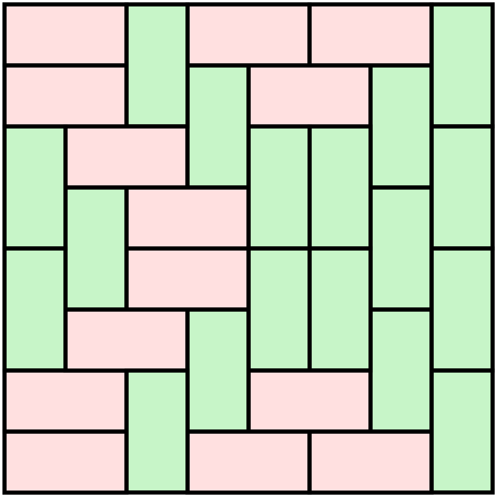

# Suddivisione di una griglia mxn in sottogriglie 1x2

Ecco una suddivisione (tiling) della scacchiera standard 8x8 in sottoscacchiere 1x2 o 2x1, ossia in tessere del domino (coppie di celle adiacenti):



Quindi la griglia 8x8 ammette un tiling con griglie 1x2 (ruotabili).

## Goal 1 - saper decidere
Comprendere per quali coppie $(m,n)$ di numeri naturali la griglia mxn è suddivisibile in griglie 1x2.

I seguenti subtask, oggetto di feedback, potranno guidarti nel conquistare la buona caratterizzazione.

* [subtask 1:](https://per-ora-costruiamo-qusti-URL-a-mano-ma-sarebbe-utile-costruzione-dinamica-e/o-da-problm.yaml) decidere, $m = 1$
* [subtask 2:](https://per-ora-costruiamo-qusti-URL-a-mano-ma-sarebbe-utile-costruzione-dinamica-e/o-da-problm.yaml) decidere, $m = 2$
* [subtask 3:](https://per-ora-costruiamo-qusti-URL-a-mano-ma-sarebbe-utile-costruzione-dinamica-e/o-da-problm.yaml) decidere, $m,n \leq 20$

### Get feedback
Puoi ottenere del feedback sia dalla riga di comando con:
```
TAlight ask --problem=tiling_mxn_by_1x2 --goal=1 --subtask=SUBTASK_NUMBER file.txt 
```
o via web, cliccando sul link del subtask quì sopra e sottomettendo lo stesso file.
In entrambi i casi, sottometti un file `.txt` di 20 righe di 20 caratteri ciascuna (non contando i caratteri di newline). Tutti i caratteri sono 0 o 1, dove un 1 nella posizione j della riga i significa che la griglia ixj ammette un tiling.
Per il subtask $st = 1,2$ ci limitiamo a controllare le prime $st$ righe, e le righe del tuo file potranno essere anche meno di 20.


## Goal 2 - saper costruire

Nei casi in cui la tua risposta sia affermativa, riesci di fatto ad esibire un tiling della griglia?

I seguenti subtask, oggetto di feedback, potranno guidarti nel diventare un maestro nell'arte della composizione di tiling.

* [subtask 1:](https://per-ora-costruiamo-qusti-URL-a-mano-ma-sarebbe-utile-costruzione-dinamica-e/o-da-problm.yaml) costruire, $m = 1$
* [subtask 2:](https://per-ora-costruiamo-qusti-URL-a-mano-ma-sarebbe-utile-costruzione-dinamica-e/o-da-problm.yaml) costruire, $m = 2$
* [subtask 3:](https://per-ora-costruiamo-qusti-URL-a-mano-ma-sarebbe-utile-costruzione-dinamica-e/o-da-problm.yaml) costruire, $m,n \leq 20$

Il tiling, se preferisci, può anche essere costruito a mano, ma poniti l'obiettivo di individuare un modo generale, e di complessità la più bassa possibile, per produrlo quando esista. Fare ciò significa dare dimostrazione costruttiva di una delle due implicazioni contenute nella buona caratterizzazione. Noi consideriamo algoritmica questa dimostrazione costruttiva se la procedura impiega tempo polinomiale (in questo caso nella dimensione dell'output).

### Get feedback
Di nuovo, puoi ottenere del feedback sia dalla riga di comando con:
```
TAlight ask --problem=tiling_mxn_by_1x2 --goal=2 --subtask=SUBTASK_NUMBER file.txt 
```
o via web, cliccando sul link del subtask di pertinenza e sottomettendo lo stesso file.
Questa volta potrai sottomettere, uno per volta, uno o più file `.txt` strutturati come segue:
nella prima riga poni i due numeri naturali $m$ ed $n$, entrambi nell'intervallo $[0,20]$, e separati da uno spazio.
Poi, con riferimento ai punti cardinali (North, South, Est, West), esprimi il tiling da tè individuato come da esempio seguente.
```
8 8
WENWEWEN
WESNWENS
NWESNNSN
SNWESSNS
NSWENNSN
SWENSSNS
WENSWESN
WESWEWES
```
Si noti come questo file d'esempio offra codifica del tiling della scacchiera visto nella figura sopra.

_Nota:_ Grazie a questo servizio, potrai inoltre interagire oltre su quelle griglie dove col goal 1 ti è stato risposto che una certa griglia non è suddivisibile mentre tu sei convinto nel contrario. Sottometti la tua suddivisione per risintonizzarci in un modo o nell'altro (scoprire perchè essa non è considerata oppure ottenere conferma che hai un baco da segnalarci (grazie!)).

Allo stesso modo, in caso di bisogno, potrai avvalerti del [servizio di aiuto che, se sei scettico sul fatto che un tiling esista per la griglia mxn, te ne svelerà uno](https://per-ora-costruiamo-qusti-URL-a-mano-ma-sarebbe-utile-costruzione-dinamica-e/o-da-problm.yaml).

```
TAlight ask --problem=tiling_mxn_by_1x2 -tiling m n 
```


## Goal 3 - saper dire di no

Per le coppie  $(m,n)$ dove la tua risposta sia negativa, vuoi distillare (e magari esprimere) una ragione per cui un tale tiling non possa esistere?
Pre-accordare un linguaggio comune per le ragioni di non-esistenza significherebbe spoilerare il problema. Pertanto, su questo goal, benchè prezioso, non offriamo alcun servizio di feedback automatico. I più eleganti od originali argomenti per la non esistenza potranno invece essere discussi in classe.

