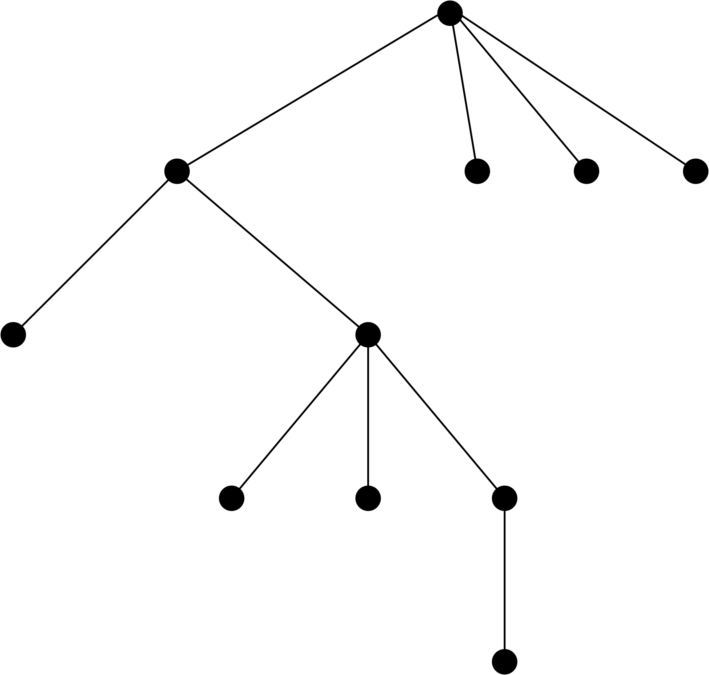
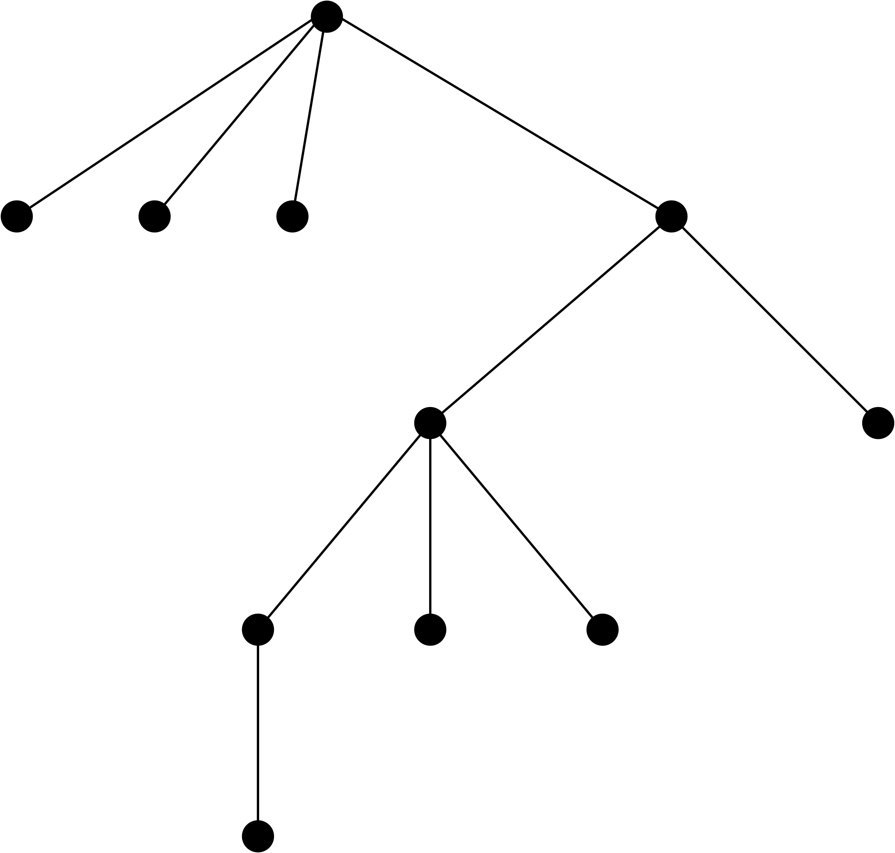

# Specchio (IOI 2002)

Un **albero (ordinato)** è formato da una **radice** e da un insieme finito e ordinato (eventualmente vuoto) di **figli**, che sono anch'essi alberi. Ad esempio, la Fig.1 rappresenta un albero: per convenzione, la radice viene disegnata in cima (cioè al contrario rispetto agli alberi veri). Come ogni albero, lo potete descrivere dicendo quanti figli ha la radice (in questo caso, $4$) e poi descrivendo uno a uno, nell'ordine da sinistra a destra, i $4$ sotto-alberi. In questo modo, ad esempio, l'albero in Fig.1 sarebbe identificato dalla seguente sequenza:

```
4  2  0  3  0  0  1  0  0  0  0
```
<p align = "center">

</p>
<p align = "center">
Fig.1 - Un albero.
</p>

Infatti, l'albero ha quattro figli sotto la radice, per cui il primo numero è $4$. A questo $4$ segue poi subito la sequenza "2  0  3  0  0  1  0", che è la descrizione del primo figlio, mentre gli ultimi tre figli sono ciascuno descritti da "0" (dato che non hanno figli).

Supponete ora di guardare l'albero riflesso in uno specchio. L'ordine dei figli di ciascun nodo risulta invertito e l'albero di Fig.1 appare come in Fig.2.

<p align = "center">

</p>
<p align = "center">
Fig.2 - L'albero di Fig.1 visto allo specchio.
</p>


Questo nuovo albero è descritto dalla sequenza
```
4  0  0  0  2  3  1  0  0  0  0
```

Fornire un metodo per passare dalla descrizione di un albero alla descrizione del suo rovesciato sinistra-destra (e viceversa).

## Input
La prima riga contiene $T$, il numero di testcase da risolvere. Seguono $T$
istanze del problema. Ogni istanza consta di una sola riga che codifica, come sopra spiegato, l'albero da rovesciare nello specchio.
In pratica, la riga contiene una sequenza di interi non negativi, separati da spazi. La sequenza descrive correttamente un albero: quindi il primo numero è il numero di figli della radice, ed è seguito dalle descrizioni dei sotto-alberi radicati nei figli della radice, prese una dopo l'altra, nel loro ordine da sinistra a destra.

## Output
L'output deve contenere una riga per ogni testase. Tale riga è costituita da una sequenza di interi non negativi separati da spazi. Tale sequenza è intesa codificare, secondo le stesse regole che per l'input già viste sopra, l'albero rovesciato sinistra-destra, ossia l'albero dato in input visto allo specchio.

## Esempio

### Input
```
2
4 2 0 3 0 0 1 0 0 0 0
4 0 0 0 2 3 1 0 0 0 0
```

### Output
```
4 0 0 0 2 3 1 0 0 0 0
4 2 0 3 0 0 1 0 0 0 0
```

## Subtask

Sono previsti i seguenti subtask.

* **[2 istanze] esempi_testo:** i due esempi del testo
* **[21 istanze] small:** $n \leq 10$
* **[22 istanze] medium:** $n \leq 100$
* **[16 istanze] big_binary:** ogni nodo ha zero oppure due figli every node has either zero or two children, $n \leq 100\,000$
* **[16 istanze] big_max_2_children:** every node has at most two children, $n \leq 100\,000$
* **[23 istanze] big:** $n \leq 100\,000$

In generale, quando si richiede la valutazione di un subtask vengono valutati anche i subtask che li precedono, ma si evita di avventurarsi in subtask successivi  fuori dalla portata del tuo programma che potrebbe andare in crash o comportare tempi lunghi per ottenere la valutazione completa della sottomissione. Ad esempio, chiamando:

```
    rtal -s wss://ta.di.univr.it/algo  connect -a size=medium  specchio -- python my_solution.py
```

vengono valutati, nell'ordine, i subtask:

**esempi_testo**, **small**, **medium**.

Il valore di default per l'argomento **size** è **big**.

Il tempo limite per istanza (ossia per ciascun testcase) è sempre di $1$ secondo.


